## Context

Kubernetes storage is one of those topics that *looks simple* in YAML but feels confusing in practice.

Terms like **PersistentVolume**, **PersistentVolumeClaim**, **StorageClass**, and **provisioner** get introduced quickly, often without a clear explanation of how they relate to one another at runtime—especially when NFS is involved.

This post explains **how NFS-backed persistent storage actually works** by walking through the relationships between Kubernetes objects, using a PostgreSQL workload as a concrete example.

This is a mental model first, implementation second.

---

## The Big Picture

At a high level, the system consists of:

- an application that needs persistent storage
- a PostgreSQL pod that consumes that storage
- an NFS server that physically stores the data
- a Kubernetes provisioner that connects the two

Kubernetes itself does **not** store data. It only coordinates *who gets access to which storage*.

```mermaid
flowchart LR
    App[Application Deployment]
    Svc[PostgreSQL Service]
    Pod[PostgreSQL Pod]

    PVC[PersistentVolumeClaim]
    SC[StorageClass]
    Prov[NFS External Provisioner]
    PV[PersistentVolume]
    NFS[NFS Server - directory on disk]

    App -->|DB_HOST| Svc
    Svc --> Pod

    Pod -->|mounts| PVC
    PVC -->|requests| SC
    SC -->|uses| Prov
    Prov -->|creates| PV
    PV -->|maps to| NFS
```



Conceptual flow of an NFS-backed Persistent Volume in Kubernetes. Pods consume storage via PVCs; StorageClasses delegate provisioning to an external NFS provisioner, which creates directories on the NFS server and registers them as PersistentVolumes.

---

## The Application Layer

An application runs as a standard Kubernetes **Deployment**.

Instead of connecting directly to a pod IP, it references a **Service** using an environment variable such as:

```ini
DB_HOST=postgres-service
```

This matters because:

- pods are ephemeral
- IPs change
- Services provide a stable access point

The application is intentionally decoupled from where Postgres actually runs.

---

## The PostgreSQL Pod

PostgreSQL runs in its own **Pod**, configured to use persistent storage.

That pod:

- mounts a volume
- does not know (or care) where the storage comes from
- references a **PersistentVolumeClaim**, not a disk

This indirection is key.

The pod says:
> “I need storage that looks like a filesystem.”

It does *not* say:
> “Give me NFS at this IP and path.”

---

## The PersistentVolumeClaim (PVC)

The **PersistentVolumeClaim** is a request, not storage itself.

It defines:

- how much storage is needed
- access mode requirements
- which StorageClass should satisfy the request

Think of a PVC as:
> “I need storage that meets these criteria.”

The PVC does **not** create storage on its own.

---

## The StorageClass

The **StorageClass** answers the question:
> “Who is responsible for fulfilling this claim?”

In this case, the StorageClass:

- references a **custom NFS provisioner**
- defines how volumes should be created
- acts as a factory, not a disk

This is where Kubernetes hands off responsibility to something external.

---

## The NFS External Provisioner

The NFS provisioner is just another **pod running in the cluster**.

It is configured with:

- the address of an NFS server
- a base directory on that server
- a unique provisioner name

When Kubernetes sees a PVC that references this provisioner, the provisioner:

- creates a directory on the NFS server
- registers a corresponding PersistentVolume
- binds it to the PVC

Kubernetes does not create directories on NFS by itself.  
The provisioner does that work.

---

## The PersistentVolume (PV)

The **PersistentVolume** represents:

- a real directory on the NFS server
- created dynamically
- managed by Kubernetes metadata

The PV:

- is bound to exactly one PVC
- references the StorageClass
- points at a specific NFS path

This is the object that actually bridges Kubernetes and storage.

---

## How the Pieces Connect

The relationship flows like this:

```text
Postgres Pod
  → PersistentVolumeClaim
    → StorageClass
      → NFS Provisioner
        → PersistentVolume
          → NFS Server Directory
```

Each layer has a single responsibility:

- Pods consume storage
- PVCs request storage
- StorageClasses decide *how* storage is made
- Provisioners create storage
- NFS servers hold data

No single object does everything.

---

## The Service Layer

PostgreSQL is exposed via a **Service** (often NodePort or ClusterIP).

The Service:

- routes traffic to the active Postgres pod
- provides a stable address
- hides pod restarts and rescheduling

This ensures:

- applications don’t care about pod lifecycles
- storage survives pod restarts
- connectivity remains stable

---

## Why This Model Works

This design gives you:

- durable storage across pod restarts
- dynamic provisioning without manual PV creation
- clear separation of concerns
- portability across environments

It also explains why debugging storage issues often requires looking at:

- PVC status
- StorageClass configuration
- provisioner logs
- NFS server permissions

Storage failures rarely live in one place.

---

## Common Points of Confusion

Some frequent misunderstandings this model clears up:

- PVCs are not storage
- StorageClasses do not store data
- Kubernetes does not manage NFS directly
- Provisioners are normal pods
- Pods never talk directly to PVs

Confusion around reported storage capacity is often caused by mixing decimal and binary byte units.  
For a clear explanation, see: [Understanding Byte Size Units (Without Overthinking Them)](/2024/02/28/understanding-byte-size-units/)

Once these are clear, storage behavior becomes predictable.

---

## Practical Takeaways

- Start debugging storage at the PVC
- StorageClasses are contracts, not resources
- Provisioners do the real work
- NFS is external to Kubernetes
- Mental models matter more than YAML

Understanding *how the system fits together* is far more valuable than memorizing fields.
